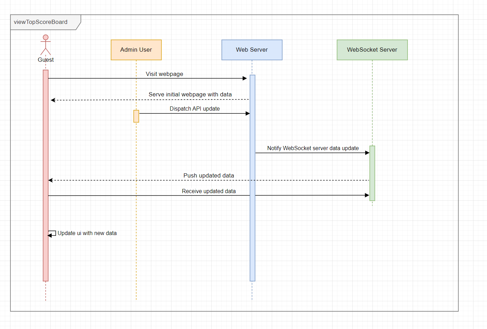
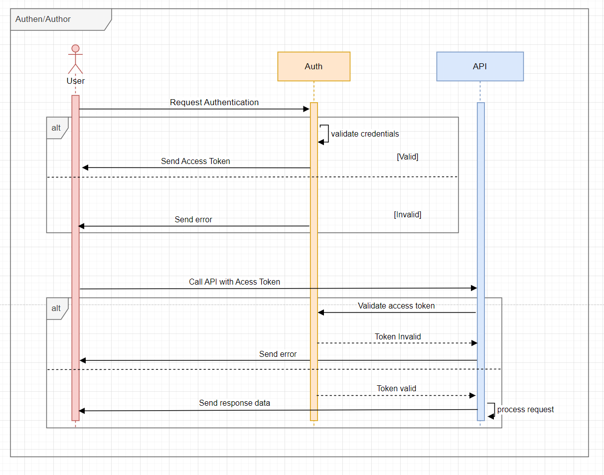

# API service backend documentation
## Introduction
Build an API service that user can visit the webpage which show top live-update scores board.

## User roles
### Guest
Guest users can perform retrieve a list of players in top 10 scores.

### Admin
Admin user can perform:
- retrieve all of players
- create a players
- update the score of players

## API Endpoints
| Endpoints    | HTTP Method | User Role    | Description                                           |
| ------------ | ----------- | ------------ | ----------------------------------------------------- |
| /login       | POST        | Admin        | Retrieve an access token if successful authentication |
| /players     | GET         | Guest, Admin | Retrieve a list of players                            |
| /players     | POST        | Admin        | Create a player                                       |
| /players/:id | PUT         | Admin        | Update score for the specific player                  |


### Authentication
```
POST /login
{
    username: string
    password: string
}
```

### Filter top 10 scores
```
GET /players?limit=10
``` 

### Update score for the specific player
```
PUT /players/:id
{
    score: number
}
Authorization: Bearer
```

### Create player
```
POST /players
{
    score: number,
    name: number,
    ...field
}
Authorization: Bearer
```

## Websocket Integration
After the admin dispatch API update, the server will fetch the top 10 player's score to all connected clients

### WS Endpoint
`ws::/localhost:8080/players/update`

## Sequence Diagram


